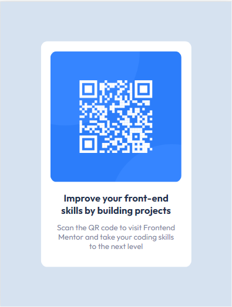

# Frontend Mentor - QR code component solution

This is a solution to the [QR code component challenge on Frontend Mentor](https://www.frontendmentor.io/challenges/qr-code-component-iux_sIO_H). Frontend Mentor challenges help you improve your coding skills by building realistic projects.

## Table of contents

- [Overview](#overview)
  - [Screenshot](#screenshot)
  - [Links](#links)
- [My process](#my-process)
  - [Built with](#built-with)
  - [What I learned](#what-i-learned)
  - [Continued development](#continued-development)
  - [Useful resources](#useful-resources)
- [Author](#author)
- [Acknowledgments](#acknowledgments)

**Note: Delete this note and update the table of contents based on what sections you keep.**

## Overview

This challenge is to build a QR code component and get to look as close to the design provided as possible.

### Screenshot

### Links

- Solution URL: [Add solution URL here](https://github.com/Jerome-Nel/qr-code-component.git)
- Live Site URL: [Add live site URL here](https://jerome-nel.github.io/qr-code-component/)

## My process

### Built with

- HTML5
- CSS3
- Flexbox
- Responsive web design
